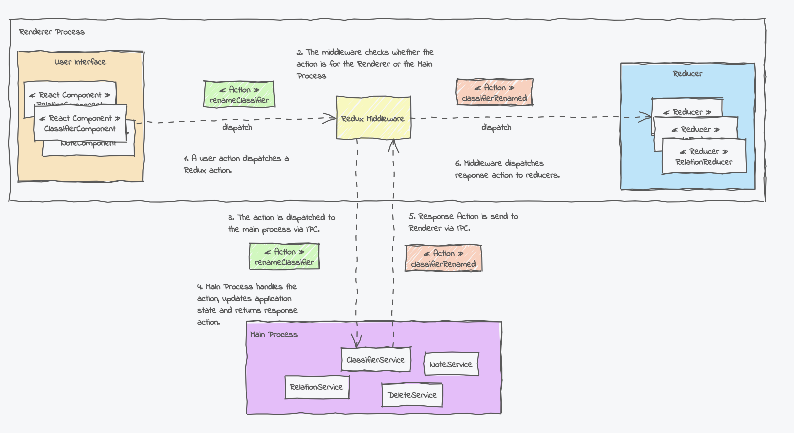

# Moving from Electron to Tauri - IPC Messaging

This small sample application is the first [part](https://www.umlboard.com/blog/moving-from-electron-to-tauri-1/) of a blog series investigating how some of [UMLBoard's](https://www.umlboard.com) core concepts can be ported to [Tauri](https://tauri.app/).


UMLBoard is based on [Electron](https://www.electronjs.org/) and uses a React/Redux implementation in the front end. This implementation is extended to also dispatch Redux actions between the Renderer and the Main process.

See the following diagram for an overview of UMLBoard's inter-process communication:



The sample application in this repository demonstrates how this messaging system can be ported from Electron to Tauri with relatively little implementation effort.

The project uses the React+Tauri+Vite template with additional dependencies to the [Redux Toolkit](https://redux-toolkit.js.org/).

## Building the Sample Application

To build and run the app, use the following command

```shell
npm run tdev
```

This will first build the React front end and afterwards build and run the Tauri application.

## Debugging

To debug the application, run the `Tauri Development Debug` task via the VS Code debugger. 

Debugging the front can be done via the `Front-end App Debug` task, but please note that this does currently only work under Windows.

## Recommended IDE Setup

- [VS Code](https://code.visualstudio.com/) + [Tauri](https://marketplace.visualstudio.com/items?itemName=tauri-apps.tauri-vscode) + [rust-analyzer](https://marketplace.visualstudio.com/items?itemName=rust-lang.rust-analyzer)
